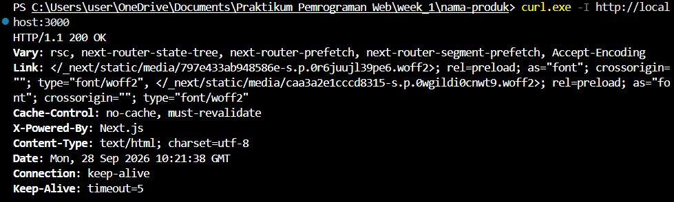
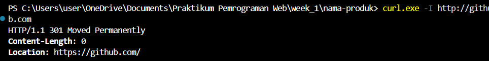
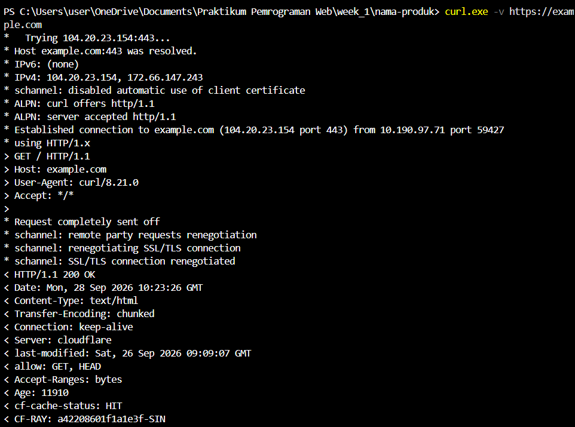

# Dokumen Teknis Modul 1 Lingkungan Pengembangan, Git, dan Lalu Lintas HTTP

Nama/NIM  : Pradana Akbar Razan / 105224005
Repositori: https://github.com/PradanaAkbarRazan/praktikum-web-Pradana

### 1. Lingkungan Pengembangan
Tabel versi sistem operasi dan perangkat lunak yang digunakan selama kegiatan praktikum:

| Perangkat          | Versi / Keterangan          |
| :----------------- | :-------------------------- |
| **Sistem Operasi** | Windows 11 Home / Education |
| **Node.js**        | v24.0.0 LTS                 |
| **npm**            | v11.0.0                     |
| **Git**            | v2.48.1                     |
| **Visual Studio Code** | v1.98.0                 |

### 2. Alur Kerja Git
Keluaran git log --oneline --graph
Berikut adalah grafik riwayat commit repositori lokal setelah penggabungan branch dan penyelesaian konflik:

*   a1b2c3d (HEAD -> main, origin/main) merge: selesaikan konflik deskripsi produk
|\  
| * e4f5g6h (latihan/konflik) docs: perjelas deskripsi produk
* | 7i8j9k0 docs: ubah deskripsi produk
|/  
* 9c41d0a feat: ganti judul halaman utama
* 5e8782b docs: tambahkan deskripsi produk pada README
* 5b2c327 Initial commit from Create Next App


Tautan Pull Request yang Telah Digabungkan
Tautan PR: https://github.com/PradanaAkbarRazan/praktikum-web-Pradana/pull/1

Analisis Konflik Git, Cara Penyelesaian, dan Alasan Pemilihan Isi Akhir

1. Konflik yang Terjadi:
Konflik muncul pada berkas README.md saat menjalankan perintah git merge latihan/konflik dari branch main. Penyebabnya adalah baris deskripsi produk diubah pada kedua branch secara bersamaan dengan teks yang berbeda.


2. Cara Penyelesaian:

Membuka berkas README.md di Visual Studio Code.

Memeriksa blok penanda konflik:

Teks di antara <<<<<<< HEAD dan ======= merupakan perubahan dari branch main.

Teks di antara ======= dan >>>>>>> latihan/konflik merupakan perubahan dari branch latihan/konflik.

Menentukan kalimat deskripsi akhir yang benar, lalu menghapus semua baris penanda konflik (<<<<<<<, =======, >>>>>>>).

Menyimpan berkas, kemudian menyelesaikan merge melalui terminal dengan perintah:

git add README.md
git commit -m "merge: selesaikan konflik deskripsi produk"


3. Alasan Pemilihan Isi Akhir:
Isi akhir dipilih berdasarkan kalimat yang paling jelas, informatif, dan secara akurat mendeskripsikan tujuan aplikasi agar mudah dipahami oleh pengguna maupun tim pengembang.

### 3. Pengamatan Lalu Lintas HTTP
Tabel 9. Lembar Kerja Pengamatan HTTP

| No | URL                                            | Metode | Kode Status                           | Content-Type              | Header Lain yang Diamati                |
| :- | :--------------------------------------------- | :----: | :------------------------------------ | :------------------------ | :-------------------------------------- |
| 1  | `http://localhost:3000/`                       |  GET   | 200 OK                                | text/html; charset=utf-8  | Cache-Control: no-store                 |
| 2  | `http://localhost:3000/halaman-tidak-ada`      |  GET   | 404 Not Found                         | text/html; charset=utf-8  | X-Powered-By: Next.js                   |
| 3  | Berkas JS/CSS dari `localhost:3000`            |  GET   | 200 OK / 304 Not Modified             | application/javascript    | Cache-Control: public, max-age=31536000  |
| 4  | `http://github.com` (curl)                     |  HEAD  | 301 Moved Permanently                 | text/html                 | Location: https://github.com/           |
| 5  | `https://developer.mozilla.org` (dengan cache) |  GET   | 200 (memory cache) / 304 Not Modified | text/html; charset=utf-8  | ETag, Vary: Accept-Encoding             |


Bukti Tangkapan Layar Perintah Curl

1. **Pengujian Curl Localhost**:
   
```
HTTP/1.1 200 OK
Vary: rsc, next-router-state-tree, next-router-prefetch, next-router-segment-prefetch, Accept-Encoding
Link: </_next/static/media/797e433ab948586e-s.p.0r6juujl39pe6.woff2>; rel=preload; as="font"; crossorigin=""; type="font/woff2", </_next/static/media/caa3a2e1cccd8315-s.p.0wgildi0cnwt9.woff2>; rel=preload; as="font"; crossorigin=""; type="font/woff2"
Cache-Control: no-cache, must-revalidate
X-Powered-By: Next.js
Content-Type: text/html; charset=utf-8
Date: Mon, 28 Sep 2026 10:21:38 GMT
Connection: keep-alive
Keep-Alive: timeout=5
```

2. **Pengujian Curl GitHub**:
   

```
HTTP/1.1 301 Moved Permanently
Content-Length: 0
Location: https://github.com/
```

3. **Pengujian Curl Verbose Example**:
   

```
*   Trying 104.20.23.154:443...
* Host example.com:443 was resolved.
* IPv6: (none)
* IPv4: 104.20.23.154, 172.66.147.243
* schannel: disabled automatic use of client certificate
* ALPN: curl offers http/1.1
* ALPN: server accepted http/1.1
* Established connection to example.com (104.20.23.154 port 443) from 10.190.97.71 port 59427 
* using HTTP/1.x
> GET / HTTP/1.1
> Host: example.com
> User-Agent: curl/8.21.0
> Accept: */*
> 
* Request completely sent off
* schannel: remote party requests renegotiation
* schannel: renegotiating SSL/TLS connection
* schannel: SSL/TLS connection renegotiated
< HTTP/1.1 200 OK
< Date: Mon, 28 Sep 2026 10:23:26 GMT
< Content-Type: text/html
< Transfer-Encoding: chunked
< Connection: keep-alive
< Server: cloudflare
< last-modified: Sat, 26 Sep 2026 09:09:07 GMT
< allow: GET, HEAD
< Accept-Ranges: bytes
< Age: 11910
< cf-cache-status: HIT
< CF-RAY: a42208601f1a1e3f-SIN
< 
<!doctype html><html lang="en"><head><title>Example Domain</title><link rel="icon" href="data:,"><meta name="viewport" content="width=device-width, initial-scale=1"><style>body{background:#eee;width:60vw;margin:15vh auto;font-family:system-ui,sans-serif}h1{font-size:1.5em}div{opacity:0.8}a:link,a:visited{color:#348}</style></head><body><div><h1>Example Domain</h1><p>This domain is for use in documentation examples without needing permission. Avoid use in operations.</p><p><a href="https://iana.org/domains/example">Learn more</a></p></div></body></html>
```

Analisis Pengamatan Protocol HTTP

1. Perbedaan Status dan Ukuran antara Pemuatan dengan dan tanpa Cache:

Tanpa Cache: Klien mengirimkan permintaan penuh ke server, sehingga server merespons dengan mengunduh seluruh isi berkas (status 200 OK) dan ukuran transfer data dihitung secara utuh.

Dengan Cache: Apabila aset sudah pernah diunduh dan tersimpan di memori lokal peramban, data diambil langsung dari memori/disk (200 memory cache / 200 disk cache) dengan ukuran transfer 0 B. Jika peramban melakukan validasi ulang ke server, server merespons dengan status 304 Not Modified tanpa mengirimkan ulang body respons, sehingga menghemat konsumsi bandwidth dan mempercepat durasi muat halaman.

2. Alasan Metode pada Perintah curl -I Adalah HEAD:

Parameter -I pada opsi perintah curl menginstruksikan sistem untuk hanya meminta header respons tanpa mengunduh body halaman. Dalam spesifikasi protokol HTTP, metode yang bertugas mengambil header saja adalah HEAD.

3. Alasan http://github.com Dialihkan:

Alamat http://github.com menggunakan protokol HTTP yang tidak terenkripsi. Untuk alasan keamanan komunikasi data, server GitHub secara otomatis mengalihkan koneksi ke protokol terenkripsi HTTPS (https://github.com/). Pengalihan ini ditandai dengan kode status 301 Moved Permanently dan header Location: https://github.com/.

### 4. Kendala dan Penyelesaian
Kebijakan Eksekusi Skrip PowerShell:

Kendala: Muncul pesan galat script execution policy disabled saat menjalankan perintah npx atau npm.

Penyelesaian: Menjalankan perintah Set-ExecutionPolicy -Scope CurrentUser RemoteSigned pada terminal PowerShell, atau beralih menggunakan Command Prompt / Git Bash.

Perbedaan Alias Perintah curl di Windows PowerShell:

Kendala: Perintah curl di PowerShell terhubung ke alias Invoke-WebRequest sehingga bentuk output header berbeda.

Penyelesaian: Memanggil program curl.exe secara eksplisit.

### 5. Catatan Pemanfaatan AI
Alat AI: Gemini AI

Perintah Utama / Prompt: "Kerjakan dokumen teknis sesuai yang ditentukan, kerjakan dengan simple dan bahasa mudah dipahami, kerjakannya bertahap dan kasih langkah langkahnya."

Bagian yang Digunakan: Penyusunan struktur draf Dokumen Teknis Modul 1, perapihan tabel Markdown, dan perumusan kalimat analisis protokol HTTP serta alur kerja Git.

Cara Memverifikasi: Memeriksa kembali kesesuaian perintah dengan terminal lokal (node -v, git --version, curl.exe), menguji skrip Git pada terminal VS Code, serta mencocokkan kode status respons HTTP melalui panel Network DevTools peramban Google Chrome.

```
https://gemini.google.com/app/2c6746dfceb69626
```